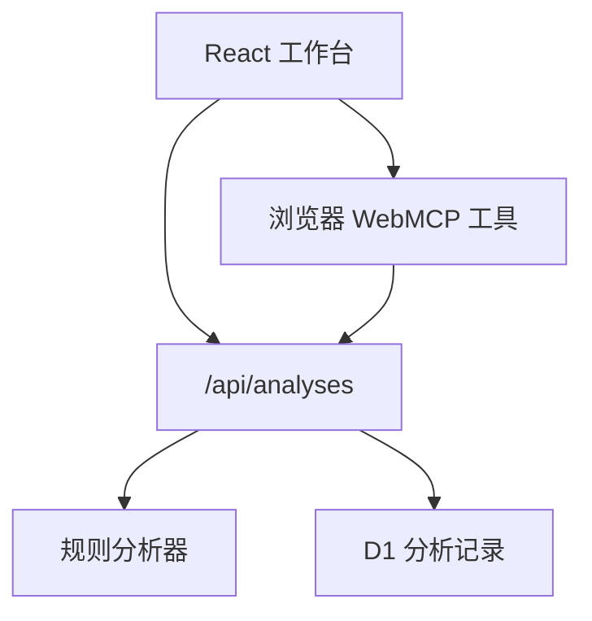

# JobHunter Agent

一个可实际操作的招聘 JD 分析工作台。把岗位描述和**真实**经历或项目资料放在一起，系统逐项拆解要求、标出文字匹配证据与潜在硬性门槛，并生成待人工核对的沟通草稿。适合在投递前快速整理思路，也展示规则引擎、服务端 API、持久化和部署的完整实现。

> **当前是规则分析版，没有接入 LLM。** 页面里的百分比是输入文本的关键词覆盖度，不是岗位适合度或录用概率；命中词语也不能证明实际能力。开场白发出前请核对事实。

## 在线体验

[Live Demo](https://jobhunter-agent.violet-panda-6449.chatgpt.site)

在两个输入框中分别点击「填入示例 JD」和「填入示例资料」，然后点击「分析岗位匹配」。也可以粘贴自己的招聘描述与作品经历。公开访客可以分析，分析结果不会保存；登录用户的历史记录按用户 ID 隔离。

## 已实现功能

- 将 JD 按句拆分，识别必须条件、加分项、技术要求及学历、年限、收费等需核实信息。
- 将提取的要求与用户提供的经历文本交叉匹配，逐条显示命中依据或缺口。
- 计算透明的文本覆盖度，并在界面解释分数的局限。
- 生成可复制、需人工修改的招聘方开场白和三组面试准备问题。
- 登录用户的分析记录保存至 D1，可查看最近 30 条并逐条删除；匿名访客可试用，不写入数据库。
- 手机和桌面布局；基础输入校验、错误反馈和浏览器 WebMCP 分析工具。

## 技术栈

| 层次 | 技术 |
| --- | --- |
| 页面 | React 19、TypeScript、Vinext / Vite、Tailwind CSS、Shadcn UI 组件、Lucide 图标 |
| 分析 | TypeScript 规则引擎：分句、类别规则、关键词交叉匹配 |
| 接口 | Vinext API Route，服务端参数校验 |
| 数据 | Cloudflare D1（SQLite），Drizzle schema 与 SQL 迁移 |
| 托管 | ChatGPT Sites / Cloudflare Workers |

## 项目架构



| 目录 | 用途 |
| --- | --- |
| `app/page.tsx`, `app/globals.css` | 工作台交互、移动布局、历史记录和结果展示 |
| `lib/analyzer.ts` | JD 提取、分类、匹配、分数和文案生成 |
| `app/api/analyses/route.ts` | 创建、读取和删除分析；登录用户隔离 |
| `db/schema.ts`, `drizzle/` | D1 数据表与迁移 |
| `.openai/hosting.json` | Site 项目身份和逻辑 D1 绑定；不含密钥 |

## 如何运行

要求 Node.js **22.13+**，使用仓库中的 `package-lock.json`：

```bash
npm ci
npm run build
npm run lint
npm run dev
```

开发服务会打印本地地址。匿名用户可直接使用规则分析，且不会写数据库。要在本地验证登录用户历史记录，需要由 Sites 预览环境提供 `oai-authenticated-user-id`，并给本地 D1 应用现有迁移；普通本地浏览器不会自动模拟 Sites 登录身份。先完成构建，再从项目根目录执行：

```bash
node --import ./scripts/sites-env.mjs ./node_modules/wrangler/bin/wrangler.js d1 execute DB --local --config dist/server/wrangler.json --persist-to .wrangler/state --file drizzle/0000_lush_lilith.sql
```

仅在修改 `db/schema.ts` 后运行 `npm run db:generate` 生成**新的**迁移；不要重新生成或改写已发布迁移。生产环境的 D1 迁移由 Sites 发布流程处理。`npm run build` 与 `npm run lint` 是代码质量检查；它们不会模拟生产登录或自动完成浏览器交互测试。

## 当前规则版如何工作

1. 按换行和句末符号切分 JD，保留有信息量的短句。
2. 用明确的词汇规则标注岗位要求、加分项、技术栈和需核实风险。
3. 将要求里的技术词与用户资料交叉匹配；有文字交集才给出证据。
4. 对普通和加分要求分别计权，给出文本覆盖度；学历或年限风险单独提示，不被一个高分掩盖。
5. 基于已有的输入生成开场白和面试准备建议，保留人工核对步骤。

这种方法速度快、可解释，但无法准确理解同义词、否定句、复杂上下文或判断项目经验的深度。它不会读取 GitHub 仓库、抓取招聘网站或自动投递。

## 扩展路线：LLM、RAG 与 Tool Calling

这些功能是**设计方案，当前尚未实现**。

1. **真实 LLM 结构化抽取**：在服务端加入模型接口和严格 JSON Schema，返回原文引证位置、置信度与可人工修正的类别；对异常输出回退到现有规则分析。密钥仅保存在服务端环境变量，设置调用限额与超时。
2. **RAG 项目证据库**：用户主动导入简历和公开项目说明，切块并建立检索索引。每个匹配结论引用具体的原始段落或仓库文件，不让模型替用户补写不存在的经历。支持更新和删除导入资料。
3. **Tool Calling**：加入经用户授权的 GitHub 只读工具，读取指定公开仓库的 README、语言和文件目录；分析结果显示工具来源。进一步扩展到招聘源时优先使用官方 API、遵守站点权限与速率限制。
4. **评估与安全**：用一组人工标注的 JD / 简历样本比较抽取召回率、误报率和无依据表述；输入做长度与注入隔离，输出保留原文证据和用户确认环节。

下一阶段也可加入明确的技能差距计划、职位收藏和经确认后生成的投递材料。当前项目不会自动联系招聘方。
