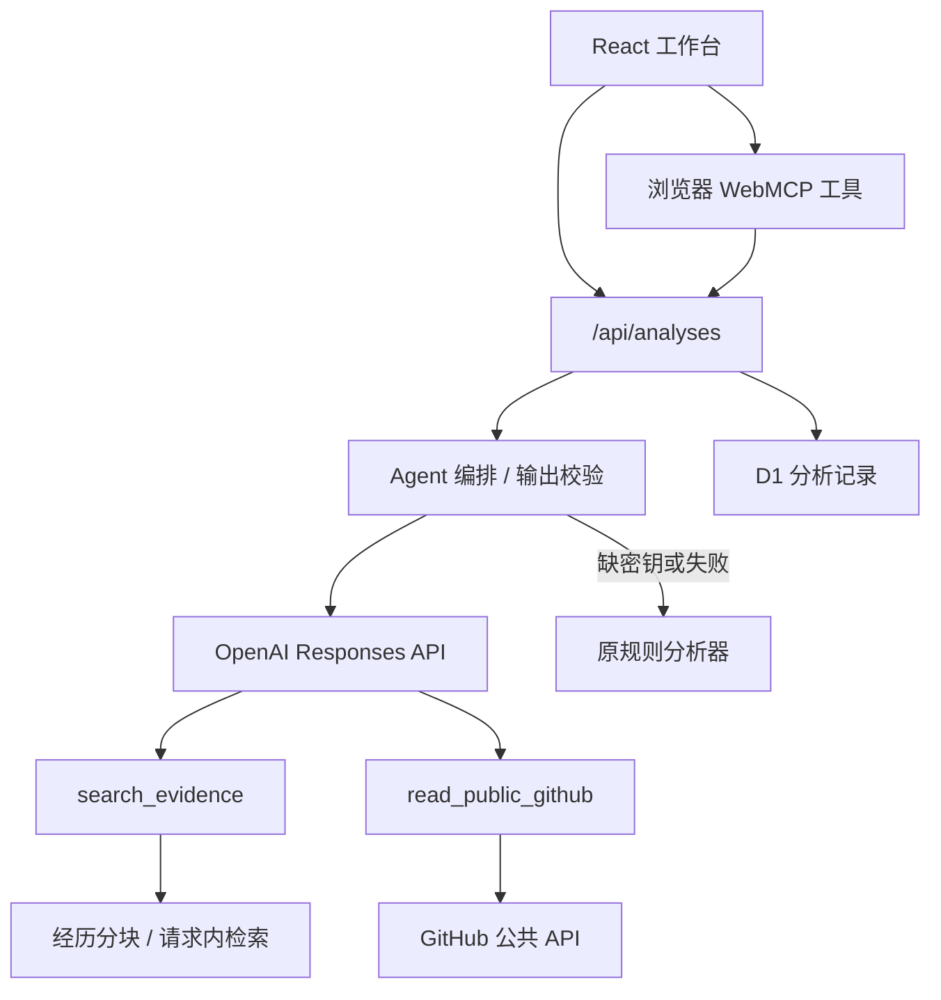

# JobHunter Agent

一个可实际操作的招聘 JD 分析工作台。把岗位描述和**真实**经历或项目资料放在一起，系统逐项拆解要求、标出文字匹配证据与潜在硬性门槛，并生成待人工核对的沟通草稿。适合在投递前快速整理思路，也展示规则引擎、服务端 API、持久化和部署的完整实现。

> **v2：服务端 AI Agent + 规则回退。** 配置 `OPENAI_API_KEY` 后调用真实 LLM；未配置、超时或输出校验失败时使用原规则引擎。页面会显示本次运行模式。百分比仅为有证据要求的文本覆盖度，不是岗位适合度或录用概率。开场白发出前请核对事实。

## 在线体验

[Live Demo](https://jobhunter-agent.violet-panda-6449.chatgpt.site)

在两个输入框中分别点击「填入示例 JD」和「填入示例资料」，然后点击「分析岗位匹配」。也可以粘贴自己的招聘描述与作品经历。公开访客可以分析，分析结果不会保存；登录用户的历史记录按用户 ID 隔离。

## 已实现功能

- 将 JD 按句拆分，识别必须条件、加分项、技术要求及学历、年限、收费等需核实信息。
- 将提取的要求与用户提供的经历文本交叉匹配，逐条显示命中依据或缺口。
- 计算透明的文本覆盖度，并在界面解释分数的局限。
- 生成可复制、需人工修改的招聘方开场白和三组面试准备问题。
- 登录用户的分析记录保存至 D1，可查看最近 30 条并逐条删除；匿名访客可试用，不写入数据库。
- 手机和桌面布局；基础输入校验、错误反馈和浏览器 WebMCP 分析工具。
- 使用 OpenAI Responses API 进行结构化 JD 抽取，模型可调用 `search_evidence` 和 `read_public_github` 两个服务端工具。
- 将用户资料按段切块，以词项检索相关原文作为 RAG 上下文；可读取用户填写的公开 GitHub 仓库 README 和基础元数据，结果保留来源 ID。
- 限制工具轮次、响应时长、仓库域名和输出结构；模型失败自动回退规则引擎。

## 技术栈

| 层次 | 技术 |
| --- | --- |
| 页面 | React 19、TypeScript、Vinext / Vite、Tailwind CSS、Shadcn UI 组件、Lucide 图标 |
| 分析 | OpenAI Responses API Agent、请求内关键词 RAG、TypeScript 规则引擎 fallback |
| 接口 | Vinext API Route，服务端参数校验 |
| 数据 | Cloudflare D1（SQLite），Drizzle schema 与 SQL 迁移 |
| 托管 | ChatGPT Sites / Cloudflare Workers |

## 项目架构



| 目录 | 用途 |
| --- | --- |
| `app/page.tsx`, `app/globals.css` | 工作台交互、移动布局、历史记录和结果展示 |
| `lib/analyzer.ts` | JD 提取、分类、匹配、分数和文案生成 |
| `lib/agent.ts`, `lib/evidence.ts`, `lib/github-tool.ts` | 模型编排、RAG 检索、GitHub 只读工具和校验回退 |
| `app/api/analyses/route.ts` | 创建、读取和删除分析；登录用户隔离 |
| `db/schema.ts`, `drizzle/` | D1 数据表与迁移 |
| `.openai/hosting.json` | Site 项目身份和逻辑 D1 绑定；不含密钥 |

## 如何运行

要求 Node.js **22.13+**，使用仓库中的 `package-lock.json`：

```bash
npm ci
npm run build
npm run lint
npm run dev
```

在本地使用 AI 时，在**未提交到 Git 的** `.env.local` 配置 `OPENAI_API_KEY`；可选 `OPENAI_MODEL`，默认 `gpt-4.1-mini`。Sites 生产环境应通过运行时 secret 配置 `OPENAI_API_KEY`，不要写入仓库、`.openai/hosting.json` 或前端变量。公开试用会调用模型，部署者需自行管理 API 用量和访问限制；没有密钥时公开站点继续使用规则分析。GitHub 工具仅访问资料中明确提供的 `https://github.com/owner/repo` 公开仓库，未使用 GitHub token。

开发服务会打印本地地址。匿名用户可直接使用规则分析，且不会写数据库。要在本地验证登录用户历史记录，需要由 Sites 预览环境提供 `oai-authenticated-user-id`，并给本地 D1 应用现有迁移；普通本地浏览器不会自动模拟 Sites 登录身份。先完成构建，再从项目根目录执行：

```bash
node --import ./scripts/sites-env.mjs ./node_modules/wrangler/bin/wrangler.js d1 execute DB --local --config dist/server/wrangler.json --persist-to .wrangler/state --file drizzle/0000_lush_lilith.sql
```

仅在修改 `db/schema.ts` 后运行 `npm run db:generate` 生成**新的**迁移；不要重新生成或改写已发布迁移。生产环境的 D1 迁移由 Sites 发布流程处理。`npm run build` 与 `npm run lint` 是代码质量检查；它们不会模拟生产登录或自动完成浏览器交互测试。

## Agent v2 工作流

1. 校验 JD 和个人资料长度，运行规则引擎准备可靠的 fallback。
2. 将资料按段切块，按 JD 关键词检索相关原文并附来源 ID；这是请求内关键词 RAG，不依赖外部向量数据库，也不跨用户保存索引。
3. 服务端调用 Responses API。模型可调用证据检索工具和 GitHub 只读工具，读取用户填写的公开项目 README 与元数据。
4. 使用 JSON Schema 和运行时校验解析结果；岗位要求必须逐字出现在 JD 中，证据 ID 必须对应实际检索片段。覆盖度由服务端重新计算。
5. 模型失败、超时、输出不合格或缺少密钥时回退既有规则引擎。界面显示运行模式、方法与来源；登录用户的结果沿用原 D1 隔离逻辑。

**边界：**检索只覆盖本次粘贴的资料和最多两个公开 GitHub 仓库的 README；它不索引整个仓库，也不证明技能掌握。模型生成的建议和开场白仍需人工核对；应用不会自动投递或联系招聘方。

## 规则回退如何工作

1. 按换行和句末符号切分 JD，保留有信息量的短句。
2. 用明确的词汇规则标注岗位要求、加分项、技术栈和需核实风险。
3. 将要求里的技术词与用户资料交叉匹配；有文字交集才给出证据。
4. 对普通和加分要求分别计权，给出文本覆盖度；学历或年限风险单独提示，不被一个高分掩盖。
5. 基于已有的输入生成开场白和面试准备建议，保留人工核对步骤。

规则引擎速度快、可解释，但无法准确理解同义词、否定句、复杂上下文或判断项目经验深度。它不调用外部模型和 GitHub。

